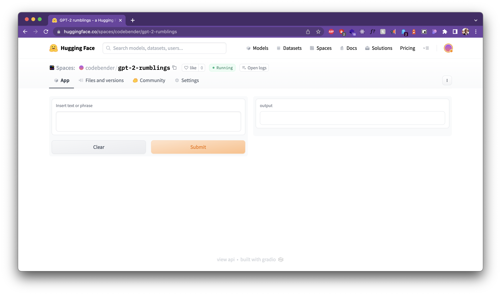

## Demo 
Here is a link to Huggingface's demo of the GPT-2 rumblings model.
[https://huggingface.co/spaces/codebender/gpt-2-rumblings](https://huggingface.co/spaces/codebender/gpt-2-rumblings)

# AI Text Generation
This repository contains jupyter notebooks and python scripts that demo the training of a GPT model and the generation of text using the trained model. 

## What is GPT?
GPT is a language model that is trained on a large corpus of text. It is a deep learning model that is trained using a technique called backpropagation. GPT in full is Generative Pre-trained Transformer. 

GPT has a lot of real-world applications and it can accelerate workflows of different kinds. 

In summary, imagine an AI model that generates new text based on a given text. This is what GPT does.

## GPT Model Generation
This is full of experiments that are based of aitextgen Python package. 

## How to run
1. Clone the repository
2. Create a virtual environment using pipenv
3. Install the dependencies using pipenv
4. Run the jupyter notebooks in the `notebooks` folder

To run the demos, simply run the python scripts after installing the dependencies.

## GPT Model Training
Different notebooks are used for different experiments.

